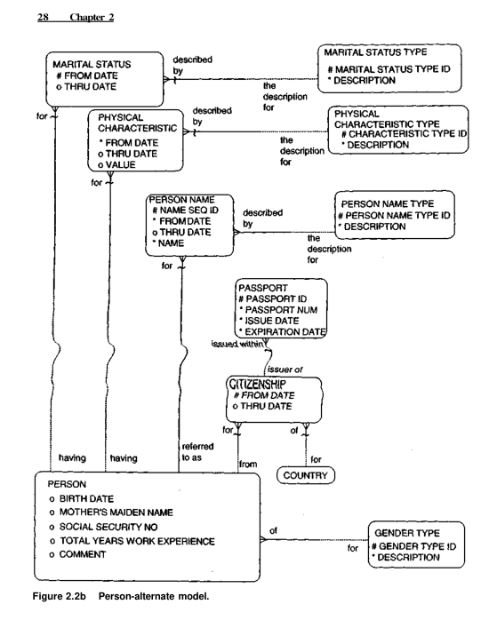

# about project

## what

จากรูปคือ plan diagram จากหนังสือเรื่อง universal data model resource book vol1  ที่ รองศาสตราจารย์ ดร.วรา วราวิทย์ ให้ผมไปศึกษา เเละนำมาสร้างเป็น database จริงๆ ด้วย postgresql แล้ว ***ทำ crud service ให้กับ ทุก entity***

## how

### tech stack

- [docker](https://www.docker.com/)
ใช้เป็น env ในการ run ทั้ง project เเละทำให้ project เป็น cloud based native application

- [postgresql](https://www.postgresql.org/)
ใช้ในการสร้าง database

- [postgresadmin](https://www.pgadmin.org/)
ใช้สำหรับสร้าง database structure เเละ execute query ใน postgresql

- [php](https://www.w3schools.com/php/)
เป็นภาษาที่ใช้ในการทำ backend

- [pdo](https://www.php.net/manual/en/book.pdo.php)
เป็น engine สำคัญในการต่อ backend กับ database